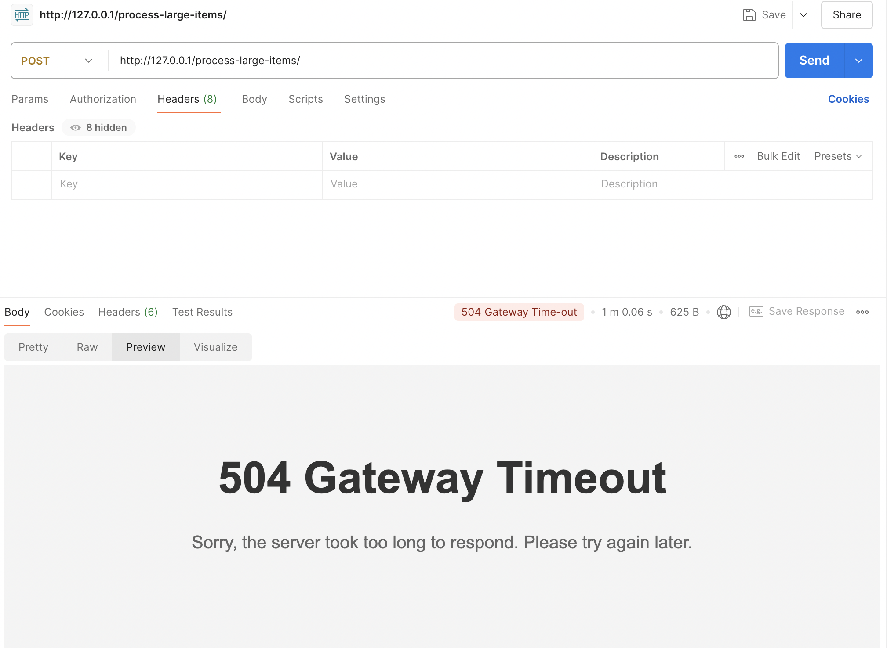
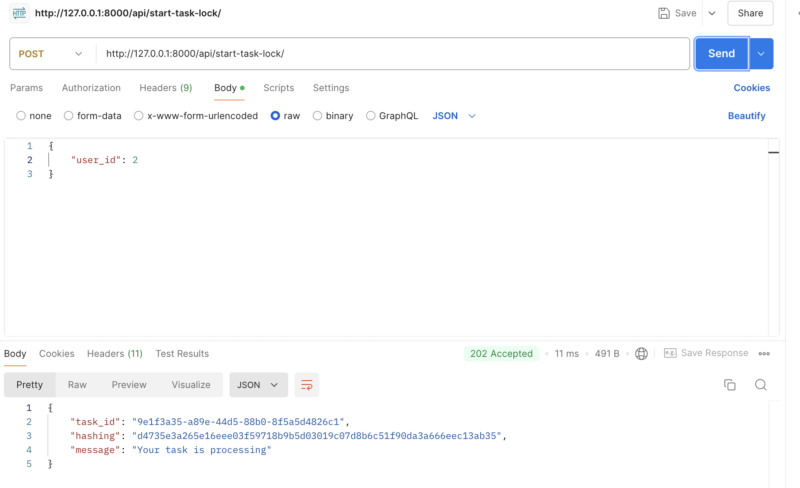
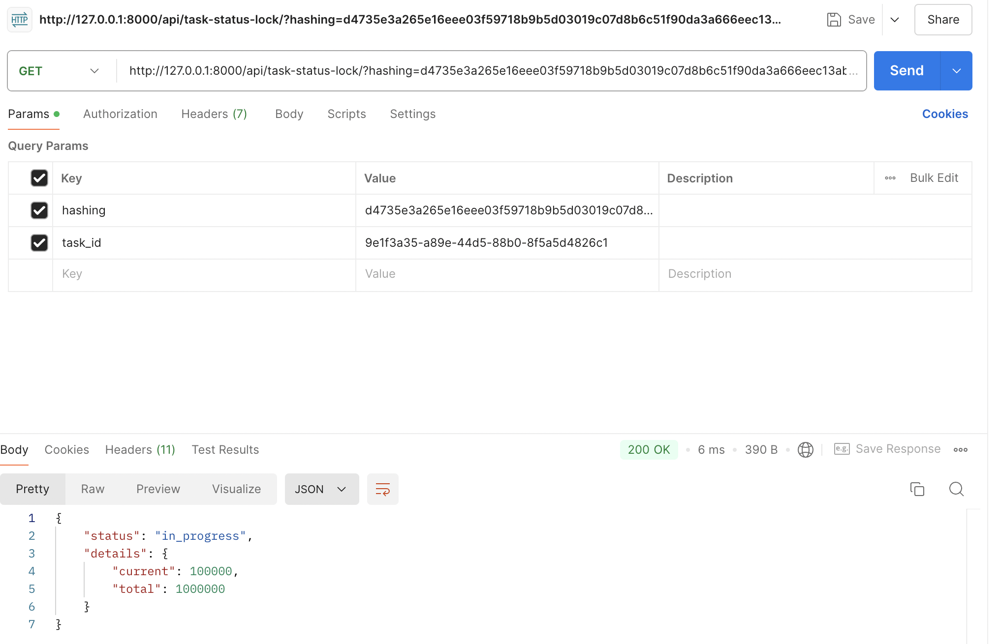
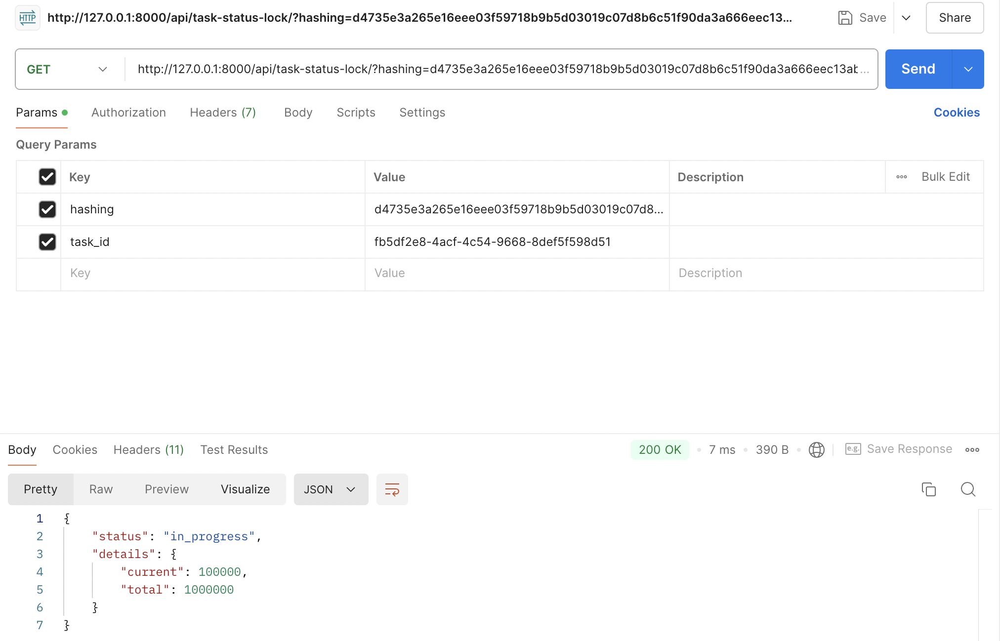
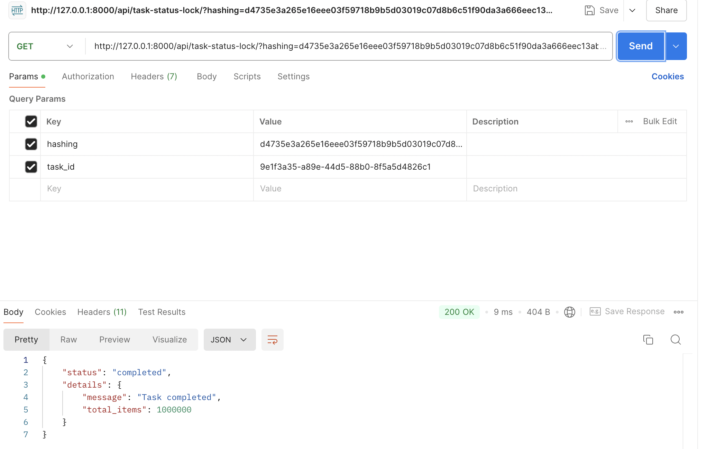
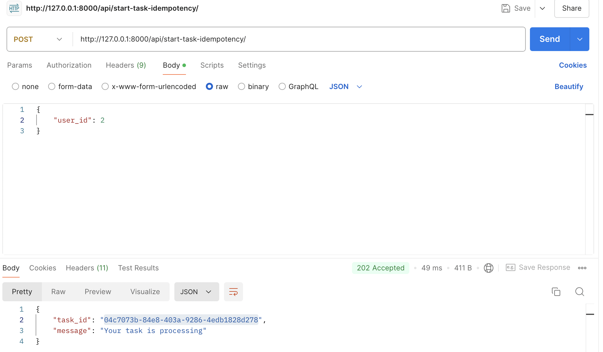
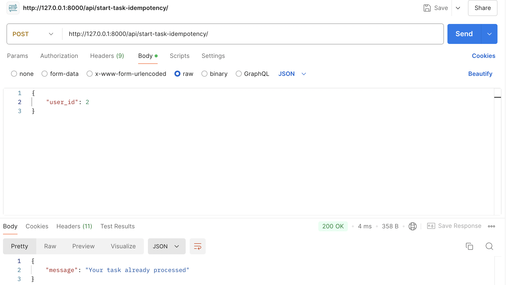
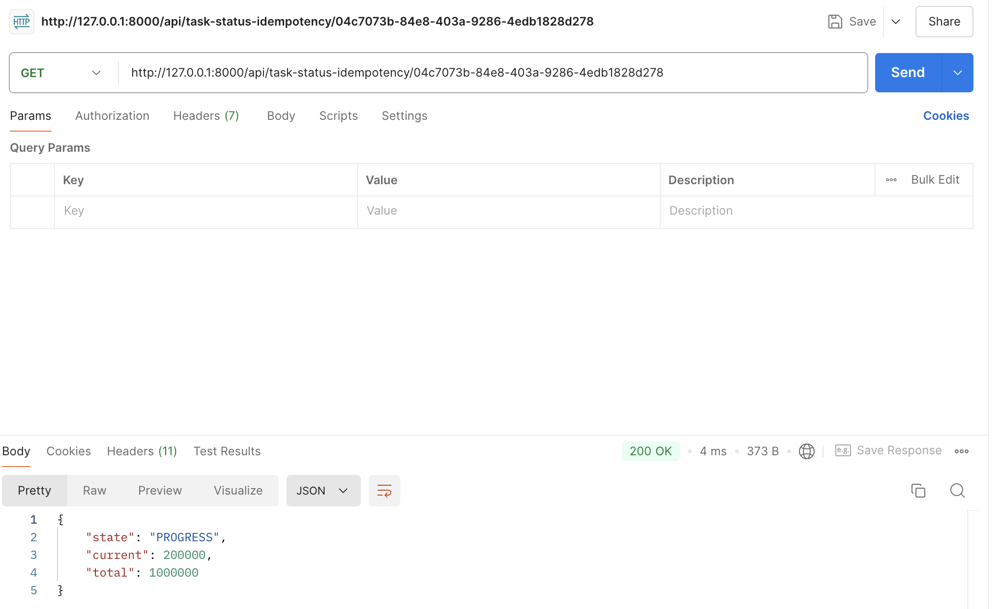
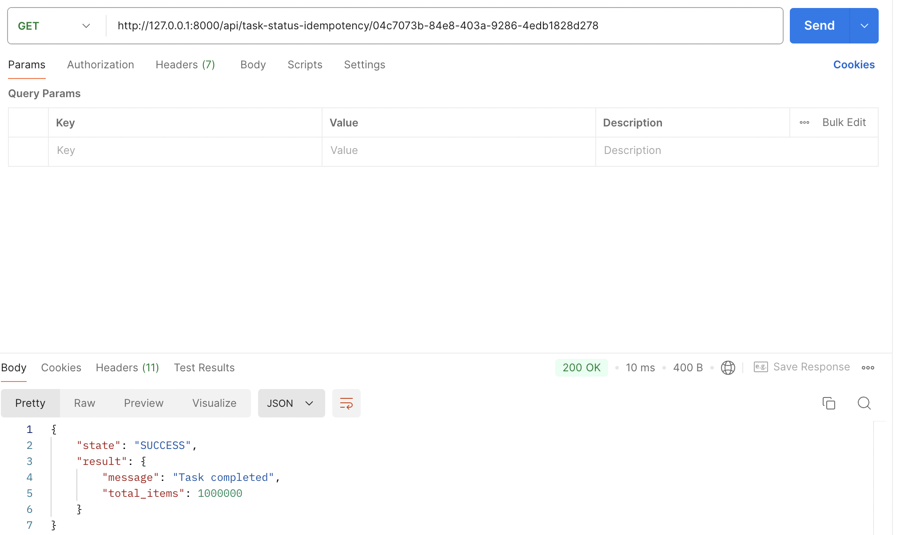

### **Requirements**
An API is used to perform operations on many items in a loop, that has 2 potential problems:
- The request takes a long time to complete, so the user may suspect the operation has failed, and may retry, running multiple parallel jobs.
- Due to web server request time out of 60 seconds, the user will not get their response. It is not possible to extend the timeout beyond 60 seconds.
 
Advise how we can resolve these issues:
- Protect the server against the user submitting parallel requests, both on the server side, but also to provide the user with partial progress updates so they will get immediate and regular feedback that the task is progressing, increasing user confidence in the operation.
- Ensure that the operation will continue and complete beyond the web server 60 seconds timeout.
 
Please use Django / Python for your solution. The logic and thought process demonstrated are the most important considerations rather than truly functional code, however code presentation is important as well as the technical aspect. If you cannot settle on a single perfect solution, you may also discuss alternative solutions to demonstrate your understanding of potential trade-offs as you encounter them. Of course if you consider a solution is too time consuming you are also welcome to clarify or elaborate on potential improvements or multiple solution approaches conceptually to demonstrate understanding and planned solution.

---
To address these two challenges using Django/Python, we can leverage **Celery** for asynchronous task management, **Redis** as a message broker. Below is a structured approach to solving the problem:

### **Key Requirements**
1. **Handling long-running tasks**: The operation takes too long, leading to web server timeouts (e.g., beyond 60 seconds).
2. **Avoid parallel requests**: Users may retry the operation multiple times, running parallel tasks.
3. **Provide feedback to users**: Users need progress updates to avoid retrying unnecessarily.

### **Solution Overview**
- **Asynchronous Task Processing with Celery**: 
  - Offload the long-running operation to Celery to ensure it runs independently of the request/response cycle. This avoids the server-side timeout.
- **Task Locking Mechanism**:
  - Implement a task locking mechanism (using a database or Redis) to prevent duplicate parallel task submissions by the same user.
  - Implement idempotency checks to ensure that the same task is not processed multiple times.
- **Progress Tracking and Immediate Feedback**: 
  - Use Celery's task state to track progress and provide real-time feedback via polling or WebSockets.
  - Use multiple threads or processes to handle multiple tasks concurrently.
- **Optional - Nginx for timeout**:
  - Use Nginx as a reverse proxy to handle long-running tasks and avoid the 60-second timeout.

---
### Issues:
1. **Long-Running Tasks**:

2. **Parallel Requests**:
- Click multiple times on the button to create multiple requests. `/process-large-items/` API
---

### **Step-by-Step Approach**

#### **Step 1: Asynchronous Task Processing with Celery**
To ensure the long-running process continues even after the 60-second web server timeout, offload the task to Celery, which will run the operation in the background.

**Task Example (`tasks.py`)**:
```python
# tasks.py
from celery import shared_task

@shared_task(bind=True)
def process_items(self, items):
    total = len(items)
    for i, item in enumerate(items):
        # Simulate long processing for each item
        process_single_item(item)
        # Update task state with progress
        self.update_state(state='PROGRESS', meta={'current': i+1, 'total': total})

    return {'status': 'completed', 'total_items_processed': total}
```

- **`shared_task`**: Defines a Celery task that can be run asynchronously.
- **`self.update_state()`**: Updates the progress of the task, so users can track it.

#### **Step 2: Task Locking to Prevent Parallel Requests**
##### Option 1. Implement a task locking mechanism (using a database or Redis) to prevent duplicate parallel task submissions by the same user.

Before starting the task, check if a similar task is already running for the user. You can implement this using a Redis key (or a database) as a lock.

**Task Locking**:
- **Redis lock (`redis_client.set()`)**: Sets a lock for the user to prevent duplicate task submissions. The lock expires after a set time (e.g., 5 minutes).
- **Unlocking**: When the task completes, remove the lock. You can add this to the task's `on_success` or `on_failure` hook.
- **Let's check detail in `items/vviews.py::start_task_lock`**
- **Click one time**: 


- **Click multiple times**:


- **Task processing**:


- **Task completed**:


##### Option 2. Implement idempotency (Using Cache or redis) checks to ensure that the same task is not processed multiple times.
- I implemented in `items/views.py::start_task_idempotency`. About basically, I used `cache` to store the key of the task. If the key is already in the cache, it will return the result of the task. If not, it will process the task and store the key in the cache.
- **Click one time**: 


- **Click multiple times**:


- **Task processing**:


- **Task completed**:


##### Option 3. Lock row in database to prevent parallel requests
- We can use `select_for_update` to lock the row in the database. This will prevent parallel requests from updating the same row simultaneously.


##### Option 4. Implement idempotency checks to ensure that the same task is not processed multiple times.

To implement idempotency checks in Django to ensure the same task isn't processed multiple times, we'll use the concept of idempotency keys.
1. **Create a Model for Idempotency Key (`Model.py`)**
```python
from django.db import models

class IdempotencyKey(models.Model):
    key = models.CharField(max_length=255, unique=True)  # Idempotency Key
    created_at = models.DateTimeField(auto_now_add=True)
    status = models.CharField(
        max_length=20, 
        choices=[
            ('PENDING', 'Pending'),
            ('IN_PROGRESS', 'In Progress'),
            ('COMPLETED', 'Completed'),
            ('FAILED', 'Failed')
        ]
    )
    result = models.TextField(null=True, blank=True)
```
- The `key` (to uniquely identify each request) (e.g: UUID,...).
- The `status` of the task.
- The `result` of the operation, if it completes successfully.

2. **Middleware for Idempotency Key (`middleware.py`)**
We can create a middleware that checks for the presence of an `Idempotency-Key` header in the request. If the key exists, it checks the database for the key's status and returns the appropriate response.
```python
class IdempotencyMiddleware:
    def __init__(self, get_response):
        self.get_response = get_response

    def __call__(self, request):
        idempotency_key = request.headers.get('Idempotency-Key')

        if not idempotency_key:
            return JsonResponse({"error": "Idempotency-Key header missing"}, status=400)

        try:
            # Try to find the key in the database
            idempotency_entry = IdempotencyKey.objects.get(key=idempotency_key)
            if idempotency_entry.status == 'COMPLETED':
                # If the task has been completed, return the result
                return JsonResponse({
                    "message": "Task already completed",
                    "result": idempotency_entry.result
                }, status=200)
            elif idempotency_entry.status == 'IN_PROGRESS':
                # If the task is still in progress, return a message indicating it's in progress
                return JsonResponse({"message": "Task in progress"}, status=202)
        except IdempotencyKey.DoesNotExist:
            # If key doesn't exist, create a new entry and proceed
            IdempotencyKey.objects.create(key=idempotency_key, status='PENDING')

        # Process the request normally
        response = self.get_response(request)
        return response
```
3. **Celery Task with Idempotency Check**
In the Celery task, we can update the status of the idempotency key as the task progresses.
```python
from celery import shared_task
from .models import IdempotencyKey

@shared_task(bind=True)
def process_items(self, idempotency_key):
    try:
        # Fetch the idempotency entry
        idempotency_entry = IdempotencyKey.objects.get(key=idempotency_key)

        # Perform your long-running task here
        result = get_items_for_processing()  # Fetch items to be processed

        # Update the idempotency status and save the result
        idempotency_entry.status = 'COMPLETED'
        idempotency_entry.result = result
        idempotency_entry.save()

        return result

    except Exception as e:
        # If there's an error, mark the task as FAILED
        idempotency_entry = IdempotencyKey.objects.get(key=idempotency_key)
        idempotency_entry.status = 'FAILED'
        idempotency_entry.save()
        raise e
```
4. **Using the Idempotency Key in the Request**
When making a request to the API, include the `Idempotency-Key` header with a unique value for each request. This key will be used to track the status of the task.

#### **Step 3: Task Progress Tracking (BackEnd)**
Celery’s `self.update_state` allows tracking the progress of the task. Users can periodically query an API endpoint to check the progress of the task.

**Task Progress API (`views.py`)**:
```python
# views.py
from celery.result import AsyncResult

def get_task_progress(request, task_id):
    task = AsyncResult(task_id)

    if task.state == 'PENDING':
        response = {'state': task.state, 'progress': 0}
    elif task.state == 'PROGRESS':
        response = {
            'state': task.state,
            'progress': (task.info.get('current', 0) / task.info.get('total', 1)) * 100,
            'current': task.info.get('current', 0),
            'total': task.info.get('total', 1),
        }
    elif task.state == 'SUCCESS':
        response = {'state': task.state, 'progress': 100, 'result': task.result}
    else:
        response = {'state': task.state, 'error': str(task.info)}

    return JsonResponse(response)
```

- **`task.state`**: Returns the current state of the task (`PENDING`, `PROGRESS`, `SUCCESS`, etc.).
- **`task.info`**: Retrieves the progress information (e.g., current items processed and total items).

#### **Step 4: Optional - Real-time Feedback Using WebSockets (BackEnd)**
Instead of polling, you can push real-time progress updates to the frontend using WebSockets.

**WebSocket Consumer for Progress Updates (`consumers.py`)**:
```python
from channels.generic.websocket import WebsocketConsumer
import json

class TaskProgressConsumer(WebsocketConsumer):
    def connect(self):
        self.accept()

    def disconnect(self, close_code):
        pass

    def send_progress(self, progress_data):
        self.send(text_data=json.dumps(progress_data))
```

**Sending Progress Updates via WebSocket in Celery Task**:
```python
from asgiref.sync import async_to_sync
from channels.layers import get_channel_layer

@shared_task(bind=True)
def process_items(self, items, user_channel_name):
    total = len(items)
    channel_layer = get_channel_layer()

    for i, item in enumerate(items):
        # Simulate processing each item
        process_single_item(item)
        
        # Send progress update to WebSocket
        progress = (i + 1) / total * 100
        async_to_sync(channel_layer.group_send)(
            user_channel_name, {
                "type": "send.progress",
                "progress_data": {'progress': progress}
            }
        )

    return {'status': 'completed', 'total_items_processed': total}
```

### **Progress Tracking and Immediate Feedback (FrontEnd)**
- `WebSockets` can be used to receive real-time progress updates from the server.
- `Long polling` can be used to periodically check the task progress.
- `Short polling` can be used to check the task status at regular intervals.
- `Http2.0` or `Http3.0` can be used to handle multiple requests at the same time.

---
### Project
### Running with Docker

To run the application using Docker-Compose:
   ```
   docker-compose up -d --build
   ```
The application will be accessible at `http://localhost:8080`.


### Running Tests
```
python manage.py test
```

### API Documentation

API documentation is available via Swagger UI:

1. Run the application
2. Access Swagger UI at `http://localhost:8080/swagger/`
3. For the WebSocket endpoint, connect to `ws://<Domain>:<port>/ws/progress/`

Here you can explore and test all available API endpoints.

---
### Considerations and Trade-offs
### **Pros and Cons**
Let's break down the **pros and cons** for each solution discussed in the context of handling long-running tasks, preventing parallel requests, and providing progress feedback.

---

### **Solution 1: Asynchronous Task Processing with Celery**

#### **Pros**:
1. **Scalability**: 
   - Celery allows for the execution of many background tasks in parallel without blocking the web server.
   - It can handle multiple workers and distribute the load efficiently.
   
2. **Decouples tasks from the request/response cycle**:
   - Long-running tasks are offloaded to Celery workers, ensuring that the web server doesn’t time out or get overburdened.

3. **Task state tracking**:
   - Celery provides built-in task states (`PENDING`, `PROGRESS`, `SUCCESS`, `FAILURE`), allowing real-time task status updates.

4. **Fault tolerance**:
   - Celery can handle failed tasks and retry them based on configuration, making it highly reliable.

#### **Cons**:
1. **Complex setup**:
   - Requires additional infrastructure such as Celery workers and message brokers (e.g., Redis or RabbitMQ).
   
2. **Maintenance overhead**:
   - More components to monitor, scale, and maintain (e.g., Celery workers, broker, and result backend).
   
3. **No real-time feedback by default**:
   - Celery alone doesn’t provide real-time progress updates unless explicitly tracked using `self.update_state`, requiring extra development effort.

---

### **Solution 2: Task Locking Mechanism (Using Redis or Database)**

#### **Option 1: Redis-based Task Locking**

##### **Pros**:
1. **Prevents parallel requests**:
   - The lock ensures that the same user doesn’t submit duplicate or concurrent tasks, reducing resource waste and conflicts.
   
2. **Efficient and fast**:
   - Redis is optimized for fast read/write operations, making it suitable for handling large-scale task locking scenarios.
   
3. **Automatic expiration**:
   - Redis locks can have expiration times, which ensures locks are released even if tasks hang, preventing deadlocks.

##### **Cons**:
1. **Increased infrastructure complexity**:
   - Requires Redis to be set up and properly managed alongside the existing infrastructure.

2. **Possible race conditions**:
   - If not handled properly, race conditions might arise when acquiring or releasing locks in high-concurrency environments.

---

#### **Option 2: Database-based Task Locking (Using `select_for_update`)**

##### **Pros**:
1. **No additional infrastructure**:
   - Uses the existing database for locking, eliminating the need for Redis or another external service.

2. **Transaction safety**:
   - The `select_for_update` mechanism ensures that updates to database rows are locked safely, preventing parallel writes.

##### **Cons**:
1. **Slower performance**:
   - Database operations are generally slower than Redis, which could impact performance when handling a large number of concurrent tasks.

2. **Database load**:
   - Locking rows in the database could increase the load on the database, affecting overall application performance.

---

### **Solution 3: Idempotency Checks**

#### **Pros**:
1. **Prevents duplicate task processing**:
   - By implementing idempotency keys, you ensure that the same task is not processed multiple times, even if a user retries.

2. **Safe retries**:
   - Idempotency allows users to retry operations safely without risking resource duplication or data corruption.

#### **Cons**:
1. **Additional logic and overhead**:
   - Requires additional logic to handle idempotency keys, including managing storage, validation, and task completion states.

2. **Database or cache dependency**:
   - Idempotency checks rely on a persistent store (database or cache), which adds to the system complexity and may increase load.

---

### **Solution 4: Progress Feedback to Users (Polling or WebSockets)**

#### **Option 1: Polling**

##### **Pros**:
1. **Simple implementation**:
   - Polling is easy to implement and doesn’t require any additional infrastructure like WebSockets.

2. **No need for persistent connections**:
   - Polling doesn’t require a persistent connection between the client and server, reducing connection overhead.

##### **Cons**:
1. **Inefficient for long-running tasks**:
   - Polling at regular intervals adds unnecessary server load, especially if many users are querying the task status frequently.

2. **Delayed feedback**:
   - Users may not get immediate updates, leading to a less responsive user experience compared to real-time feedback.

---

#### **Option 2: WebSockets**

##### **Pros**:
1. **Real-time feedback**:
   - WebSockets provide immediate updates to the user as task progress changes, enhancing the user experience.

2. **Efficient for real-time applications**:
   - WebSockets are highly efficient for scenarios where continuous updates are needed (e.g., task progress, chat applications).

##### **Cons**:
1. **Complex setup**:
   - Requires WebSocket server setup (e.g., Django Channels) and more complex front-end handling compared to polling.

2. **Scalability challenges**:
   - Maintaining many WebSocket connections for real-time updates can put additional strain on the server, especially if not scaled properly.

3. **Persistent connection overhead**:
   - WebSockets require persistent connections, which may consume more resources compared to short-lived HTTP requests in polling.

---

### **Summary of Pros and Cons for Each Solution**:

| **Solution**                                | **Pros**                                                                 | **Cons**                                                                 |
|---------------------------------------------|-------------------------------------------------------------------------|-------------------------------------------------------------------------|
| **Celery (Asynchronous Task Processing)**   | - Scalable<br>- Fault-tolerant<br>- Offloads tasks from the web server  | - Complex setup<br>- No real-time feedback without extra logic          |
| **Redis-based Task Locking**                | - Fast and efficient<br>- Prevents parallel requests<br>- Auto-expiration | - Requires Redis infrastructure<br>- Potential race conditions          |
| **Database-based Task Locking**             | - Uses existing DB<br>- Transaction-safe                                | - Slower performance<br>- Adds load to the database                     |
| **Idempotency Checks**                      | - Prevents duplicate task submissions<br>- Safe retries                 | - Extra logic required<br>- Depends on cache/database                   |
| **Polling for Progress Updates**            | - Simple to implement<br>- No persistent connections needed             | - Inefficient for long tasks<br>- Delayed feedback                      |
| **WebSockets for Real-time Updates**        | - Real-time feedback<br>- Efficient for real-time scenarios             | - Complex setup<br>- Scalability issues with many connections           |

---

### **Best Solutions for Microservices**:

#### **Celery (Asynchronous Task Processing)**:
- **Pros for Microservices**:
  - **Scalability**: Microservices can leverage Celery to handle large-scale asynchronous tasks across multiple workers. Each service can independently process tasks in the background, making the overall system more responsive.
  - **Fault Tolerance**: Celery is well-suited for distributed systems like microservices. Workers are fault-tolerant, and tasks can be retried or delegated to other workers in case of failure, which aligns well with the microservices' resilience goals.
  - **Decoupling**: Microservices typically require loosely coupled components, and Celery helps decouple long-running operations from the API layer.

- **Cons**:
  - **Complex Setup**: Requires additional infrastructure such as message brokers (e.g., RabbitMQ, Redis), Celery workers, and task result backends. This introduces complexity in managing multiple components.
  - **No Real-Time Feedback by Default**: Users won’t receive real-time feedback unless additional logic (e.g., polling, WebSockets) is implemented, which adds complexity.

#### **Redis-based Task Locking**:
- **Pros for Microservices**:
  - **Fast and Efficient**: Redis is fast and lightweight, making it an ideal choice for microservices that require efficient task locking or caching solutions.
  - **Shared Across Services**: In a distributed system, Redis can serve as a central store for task locks, shared across microservices, preventing multiple services from executing the same task in parallel.
  - **Scalability**: Redis can easily handle a large number of task locks and state management in a microservice architecture with minimal performance impact.

- **Cons**:
  - **Requires Redis Infrastructure**: The introduction of Redis adds another dependency to the microservice stack, which needs to be managed and scaled.
  - **Potential Race Conditions**: Handling race conditions correctly requires careful design, particularly when services compete for the same lock or state in Redis.

#### **Database-based Task Locking**:
- **Pros for Microservices**:
  - **Existing Infrastructure**: It leverages the existing relational database already used by the microservice, reducing the need for additional infrastructure.
  - **Transactional Safety**: With `select_for_update`, you can ensure safe task execution in scenarios where data consistency is critical.

- **Cons**:
  - **Slower Performance**: Using the database for task locking can slow down the system, especially in a high-traffic microservices environment.
  - **Increased Load**: Adding task locking responsibilities to the database increases the load and may lead to performance bottlenecks in other services relying on the database.

#### **Idempotency Checks**:
- **Pros for Microservices**:
  - **Safe Retries**: In microservices, network issues or failures are common, and idempotency ensures that the same task or request isn't executed multiple times, preventing duplicate processing.
  - **Prevents Data Corruption**: Idempotency keys ensure safe processing, particularly important in distributed systems where retries or duplicate requests might happen due to network failures or race conditions.

- **Cons**:
  - **Additional Logic**: Requires extra logic to manage idempotency keys and ensure proper validation and expiration. This adds some complexity to microservice implementations.
  - **Dependency on Cache/Database**: Idempotency keys need to be stored in a persistent store like Redis or a database, adding overhead to the system.

#### **Polling for Progress Updates**:
- **Pros for Microservices**:
  - **Simple to Implement**: Polling is a straightforward approach that doesn’t require any complex infrastructure like WebSockets, making it suitable for microservices that don’t need real-time updates.
  - **No Persistent Connections**: Unlike WebSockets, polling doesn’t require maintaining long-lived connections, which can reduce the resource footprint on the server.

- **Cons**:
  - **Inefficient for Long-Running Tasks**: In a microservices system with many tasks, constant polling can result in unnecessary load on the server, leading to inefficiencies.
  - **Delayed Feedback**: Polling introduces delays between status updates, resulting in a suboptimal user experience.

#### **WebSockets for Real-time Updates**:
- **Pros for Microservices**:
  - **Real-time Feedback**: Provides immediate updates to the user, which is ideal for scenarios where instant progress tracking is important, such as real-time dashboards or notifications in microservices.
  - **Efficient for High-Interaction Systems**: WebSockets work well for microservices that require frequent updates and low-latency communication, like chat services or live data streams.

- **Cons**:
  - **Complex Setup**: WebSockets require an additional layer of infrastructure (e.g., Django Channels, event-driven architecture) and more complex state management, especially in microservices.
  - **Scalability Challenges**: Managing a large number of WebSocket connections across distributed microservices can be challenging and resource-intensive.
  - **Persistent Connection Overhead**: WebSockets maintain a persistent connection, which can increase server load, especially when dealing with a large user base.

---
